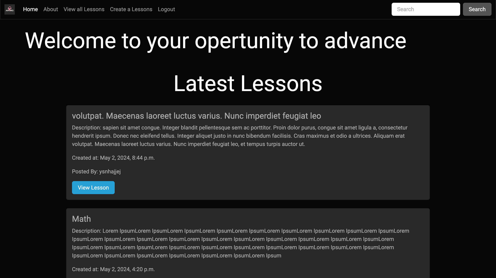
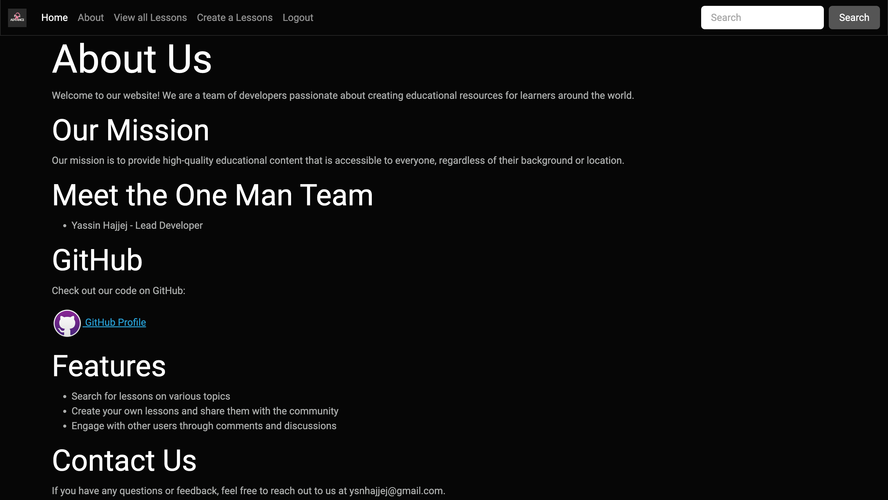
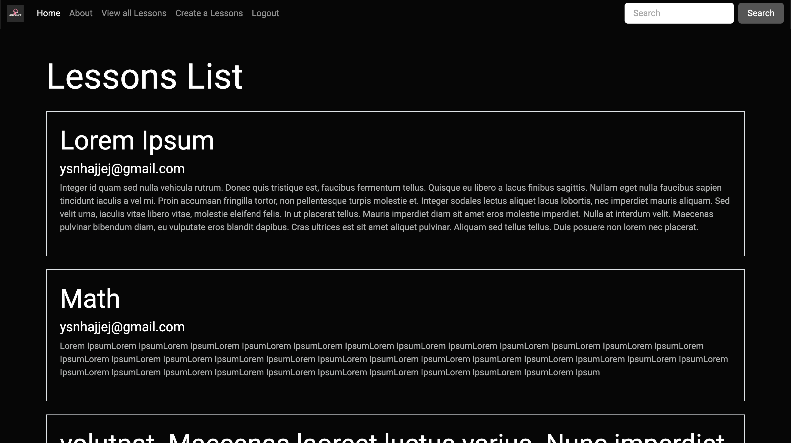
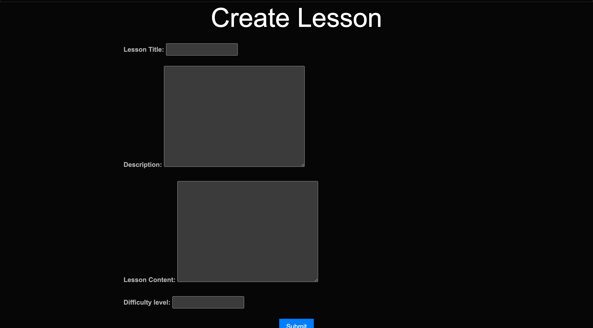

# FreeAdvance
Our mission is to provide high-quality educational content that is accessible to everyone, regardless of their background or location.

# Screenshot

# Technologies Used

- Python
- HTML
- CSS
- Bootsstrap
- Django
- 

# Linkes

[Project Planning](https://trello.com/b/YDGUXo9r/freeadvance)
[GitHub](https://github.com/YassinHajjej/FreeAvdvance)
[FreeAdvance](https://learningapp-6a1334bcd49b.herokuapp.com/)

# Next Steps

- Design enhancment. 
